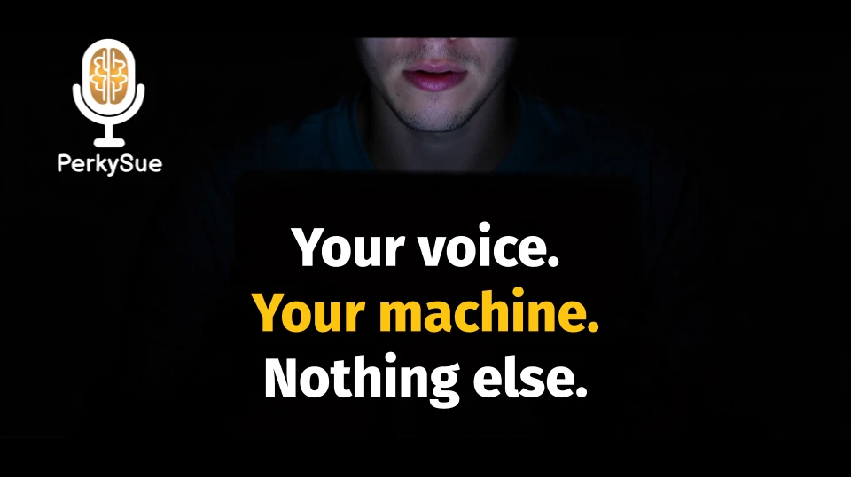

# 🎤 PerkySue — Your voice. Your machine. Nothing else.

<p align="center">
  
</p>

**Voice-to-text with AI superpowers. 100% local. 100% private.**  
*Created by Jérôme Corbiau | Apache 2.0 | 0.29.0*

Press a hotkey, speak, and polished text appears wherever your cursor is — in any app, any window, any text field. No cloud. No account. No data leaves your machine. Ever.

> **📅 Public release (Windows build):** The first **downloadable** release is planned for **Tuesday, April 14, 2026**. **Documentation and source** are on **[github.com/PerkySue/PerkySue](https://github.com/PerkySue/PerkySue)** now — watch **[Releases](https://github.com/PerkySue/PerkySue/releases)** for install packages when they ship.

---

## ⚡ What it does at a glance

PerkySue is more than dictation — it’s a **local AI layer on top of your whole OS**.

| | |
| :--- | :--- |
| 🎙️ **Unlimited dictation** | Whisper-based, accurate, **free forever** (`Alt+T`). |
| 🎯 **Smart Focus** | Trigger in one app, work in another — the result injects **where you started**. |
| 🗣️ **Voice-to-voice (Pro)** | Sue can **speak back**: explains rewrites, comments on email tone, answers aloud. |
| 🧠 **AI voice layer** | Dictate prompts straight into ChatGPT, Claude, Cursor, VS Code — same workflow, less typing. |
| 📨 **Instant emails & rewrites** | `Alt+M`, `Alt+I`, and the other Pro transforms — see hotkey table below. |
| 🛡️ **Private by design** | STT + LLM on **your** CPU/GPU. Core pipeline: no audio sent to PerkySue for dictation. |

---

## 🎬 See it in action

**Next asset to ship:** a short GIF at **`App/assets/Github/hook_demo.gif`** (~800 px, 5–10 s) — e.g. Gmail compose → **`Alt+M`** → speak → email appears. Add a centered `` under the banner once the file exists (same folder as `banner.webp`).

**Longer demo:** ~30 s video — store **`App/assets/Github/full_workflow_demo.mp4`** in the repo and link it, or use **YouTube (unlisted)**; README won’t autoplay video like a GIF.

---

## 🛑 Why PerkySue exists (short)

**1. Privacy — your voice is biometric data.**  
Cloud tools capture, transmit, and often retain voice and prompts. **PerkySue processes audio in RAM and discards it** for the core dictation pipeline — nothing logged or transmitted to PerkySue for that path.

**2. Workflow — stop waiting, start multitasking.**  
**Smart Focus** locks onto the cursor where you pressed the hotkey. Start an email in Outlook, Alt-Tab away — the finished text still lands in Outlook.

**3. Beyond dictation — an active local agent.**  
Standard tools type what you say. PerkySue runs a **local LLM** for rewrites, email, Q&A, and more — plus optional **Pro TTS** so Sue can comment aloud. **Your curiosity stays on the machine** — no chat history in someone else’s cloud for Ask.

There’s more depth below (modes, privacy table, install). The long-form story is still here — we just lead with the punch.

---

## 🗣️ The “Sue speaks” experience (Pro TTS)

With **Pro** and TTS enabled, Sue isn’t only a typewriter — she **metacomments** on what she does:

> **You (`Alt+I` on selected text):** *“Make this paragraph punchier for a marketing intro.”*  
> **Sue:** Replaces the text in place.  
> **Sue (voice):** *“I tightened phrasing and leaned on active verbs for more impact.”*

Ask with **`Alt+A`** and she can answer **aloud** while the reply is also available in text. Engines: **Chatterbox** / **OmniVoice** — default voice included; more packs on Patreon. Details: [`ARCHITECTURE.md`](ARCHITECTURE.md) (*Pro TTS*).

---

## 🚀 Quick Start

See **[GETTING_STARTED.md](GETTING_STARTED.md)** for the full step-by-step.

⚠️ AI outputs can be wrong or inappropriate — **always review** before sending. See the **AI Output Disclaimer** in [PRIVACY.md](PRIVACY.md).

**TL;DR**

1. Run **`install.bat`** once — **embedded Python 3.11** (from `Assets/`, cache, or python.org), **pip**, **tkinter**, **GPU detection**, **Python packages** (including CUDA-enabled STT wheels on NVIDIA when applicable), **llama-server** backends into **`Data/Tools/`**, optional **VC++** DLLs from `Assets`, optional desktop shortcut. **No system Python required.** *(This does **not** replace NVIDIA display drivers — those are installed separately via Windows / NVIDIA if you want GPU acceleration.)*
2. Add an LLM: **Settings → Recommended Models**, or drop a **`.gguf`** in **`Data/Models/LLM/`** (first-run download may need network).
3. Run **`PerkySue Launch.bat`** — Whisper may fetch weights on first launch; then **`Alt+T`** to transcribe.

**Update behavior (important):** About → Check for updates now stages `App/` + portable root launch/docs files, then runs a post-update consistency check at next startup. If critical runtime pieces are missing/broken, PerkySue can auto-start `install.bat` and stop normal startup so repair happens first.

**Requirements:** Windows **10/11** · **8 GB** RAM minimum (**16 GB** recommended) · Microphone · **NVIDIA GPU** optional (often **5–10×** faster) — **`Alt+T`** is great on CPU with **`tiny`** / **`small`** Whisper.

Stuck? **[TROUBLESHOOTING.md](TROUBLESHOOTING.md)** · partial install → *Manual recovery* in **GETTING_STARTED.md**.

---

## 💡 Highlights — what people use it for

### 🎙️ Alt+T · Transcribe — free, forever

Raw transcript at the cursor. No LLM, no subscription. [Whisper](https://github.com/openai/whisper) from **`tiny`** to **`large-v3`**.

### Alt+T as a voice layer for AI chats

Cursor in any chat input → **`Alt+T`** → speak your prompt → Enter. PerkySue doesn’t replace your tools; it **speeds them up** without changing habits.

### Custom prompts — `Alt+V` / `Alt+B` / `Alt+N`

Three **editable** slots in the GUI. Pattern: *select text → hotkey → short voice instruction* (support replies, code review style, social tone, etc.). **Everything stays local.**

### ✏️ Alt+I · Improve · 📨 Alt+M · Email · 🧠 Alt+A · Ask

- **`Alt+I`** — selection + voice instruction → replaced in place.  
- **`Alt+M`** — cursor in compose window → professional email from your intent.  
- **`Alt+A`** — local voice Q&A. **Free:** Chat tab in-app, standalone questions (no multi-turn). **Pro:** cursor injection, conversation history, optional **voice-to-voice** (Sue speaks back via Pro TTS).

---

## ⌨️ All voice modes

| Hotkey | Mode | What it does | Free |
|--------|------|--------------|:----:|
| `Alt+T` | Transcribe | Raw transcription (no LLM) | ✅ |
| `Alt+H` | Help | Ask about PerkySue — answer in app | ✅ |
| `Alt+A` | Ask | Voice Q&A with local LLM | ✅* |
| `Alt+I` | Improve | Rewrite selected text with voice instructions | Pro |
| `Alt+P` | Professional | Formal rewrite — tone + errors | Pro |
| `Alt+L` | Translate | Translate to target language | Pro |
| `Alt+C` | Console | Intent → shell command | Pro |
| `Alt+M` | Email | Dictate → formatted email | Pro |
| `Alt+D` | Direct Message | WhatsApp, Slack, Discord tone | Pro |
| `Alt+X` | Social Post | LinkedIn, X, YouTube, Reddit | Pro |
| `Alt+S` | Summarize | Condense to key points | Pro |
| `Alt+G` | GenZ | Casual modern rewrite | Pro |
| `Alt+V` / `B` / `N` | Custom | Your prompts (GUI) | Pro |
| `Alt+Q` | Stop | Stops listening, generation, and voice output | ✅ |
| `Alt+R` | Re-inject | Pastes the **latest finalized result** again (any time this session) | ✅ |

*\* Free Ask = in-app only, no multi-turn. Pro Ask = cursor injection + conversation history + voice-to-voice (TTS).*

**Stop (`Alt+Q`):** cancels **microphone listening**, ongoing **LLM generation**, and **TTS playback** — globally. Hotkeys work with **left Alt** and **AltGr** (EU keyboards).

**Clipboard paste window (`Ctrl+V` after auto-paste):** After PerkySue injects text, your **previous** clipboard is restored after a delay (factory default **5 seconds**) **unless** you copy something else first — so **Ctrl+V** can still paste the PerkySue result during that window. Change the duration under **Settings → Performance → Clipboard paste delay (s)** (`0` = restore immediately, legacy behavior). **Re-inject (`Alt+R`)** re-pastes the latest finalized PerkySue result for this session (not Help mode), independent from that 5-second window.

**Pro:** **30-day email trial** (once per address), then **$9.90/mo** or **yearly** billing on **[perkysue.com/pro](https://perkysue.com/pro)** via Stripe when live. Billing uses **Stripe / Brevo / perkysue.com** for **licensing only** — not your voice or transcripts ([PRIVACY.md](PRIVACY.md)).

---

## 🤔 PerkySue vs. competition

**vs. built-in OS dictation:** transcribe *and* transform — email, improve, translate, custom slots, local Ask, **16 GUI languages**.

**vs. cloud dictation:** audio for dictation **doesn’t leave your machine** — works offline for core paths after setup.

**vs. other OSS STT tools:** local **LLM** pipeline, selection + voice instructions, Smart Focus, Help mode, Pro **TTS** commentary — see table above.

---

## 🔒 Privacy

| | PerkySue (core) | Typical cloud dictation |
| :--- | :---: | :---: |
| **Audio sent to server (dictation)** | ❌ **Never** | ✅ Yes |
| **Internet required for Alt+T** | ❌ No* | ✅ Yes |
| **Account for Alt+T** | ❌ No | ✅ Often |
| **Voice retained / trained on** | ❌ **Never** (core) | ⚠️ Often |
| **Open source** | ✅ | ❌ |

\*After setup, **Free paths** work offline. **Pro trial/subscription** needs short online license steps — still **no** audio to PerkySue for dictation. Full detail: **[PRIVACY.md](PRIVACY.md)**.

---

## ⚙️ Configuration

System defaults live under **`App/`** (updated with releases); your overrides stay in **`Data/Configs/config.yaml`**.

```yaml
stt:
  model: "large-v3"
  language: "fr"
llm:
  n_ctx: 0
  max_tokens: 2048
hotkeys:
  transcribe: "ctrl+shift+t"
```

Most options are in **Settings** in the GUI. Factory reference: `App/configs/defaults.yaml`. Custom voice mode overlays: `Data/Configs/modes.yaml`. **Injection:** `injection.clipboard_restore_delay_sec` (UI: **Performance → Clipboard paste delay**) controls how long the PerkySue result stays in the clipboard before restore; **`Alt+R`** / `reinject_last` hotkey is listed under **Settings → Shortcuts**.

**TTS model governance:** PerkySue ships a pinned TTS model registry spec (`App/configs/model_registry.yaml`) and keeps a deterministic local status under `Data/Models/TTS/registry.json`. This reduces surprise redownloads and keeps model updates tied to PerkySue releases.

**Custom avatars/skins:** user-created content belongs under `Data/Skins/...` (portable user data). You do not need to add custom avatars into app-bundled skin folders.

---

## 🖥️ Platform · roadmap

✅ **Windows 10/11** (NVIDIA, AMD, Intel, CPU)  
🚧 **macOS** — coming soon (Apple Silicon). Contributors welcome.  
🚧 **Linux** — planned. Contributors welcome.

**Roadmap highlights:** TTS (Pro) shipped — Chatterbox / OmniVoice; **Enterprise** KB & deployment — [hello@perkysue.com](mailto:hello@perkysue.com); **Avatar Creator page** (easy custom avatar generation in-app) — planned; **plugin architecture** — planned.

---

## Why I built it

PerkySue started as a **personal productivity** tool — voice → **local STT** → **local LLM** → **global injection**, without shipping prompts or audio to a product server for dictation. **Product architecture** meets **UX-first** engineering; the codebase is **human-led** and co-developed with modern tooling where it helps. See also the longer narrative in earlier sections and in **[ARCHITECTURE.md](ARCHITECTURE.md)**.

---

## 📄 License · third-party · plan summary

**License:** [Apache 2.0](LICENSE) — PerkySue **core stays open source**.

**Key deps:** Python · [Whisper](https://github.com/openai/whisper) · [faster-whisper](https://github.com/SYSTRAN/faster-whisper) · [CTranslate2](https://github.com/OpenNMT/CTranslate2) · [llama.cpp](https://github.com/ggml-org/llama.cpp) · **Chatterbox / OmniVoice** (TTS — see ARCHITECTURE) · [CustomTkinter](https://github.com/TomSchimansky/CustomTkinter). You are responsible for license notices in builds you redistribute.

**Plans:** **Free** — `Alt+T` forever. **Pro (~$9.90/mo)** — all LLM modes + custom slots + TTS. **Supporter Pack** — extra voices on [Patreon](https://patreon.com/perkysue).

---

## 📋 Changelog

### Beta 0.29.1 (April 2026) — shipped
- **Hotkeys:** `Alt+R` re-inject reliability fixes + shortcuts reset persistence fix + arrow-key hotkey parsing support.
- **Docs:** Clipboard default remains **5s**, Data-owned custom avatar guidance, and release ops updates.
- **Details:** **[CHANGELOG.md](CHANGELOG.md)**.

### Beta 0.29.0 (April 2026) — shipped
- **Updates:** Fix **Update** button crash (`Paths.cache` instead of invalid `data_dir`). Use tag **`v0.29.0`** to re-test the full download + install from **0.28.9**.
- **Details:** **[CHANGELOG.md](CHANGELOG.md)**.

### Beta 0.28.9 (April 2026) — shipped
- **Updates:** GitHub checker handles **no “latest” release**, **prereleases**, and **tag archives**; optional **`PERKYSUE_UPDATE_REPO`**. Installer syncs root **`*.bat`** / **`*.md`** / **`LICENSE`** with **`App/`**.
- **Licensing UX:** Longer passive **`/check`** interval; immediate sync after checkout / wizards / Stripe; optional **Restart** hint after paying.
- **Details:** **[CHANGELOG.md](CHANGELOG.md)**.

### Beta 0.28.8 (April 2026) — shipped
- **Chat + Help UI:** redesigned Chat tab (pills, input bar, bubbles, model line). Statuses **`generating`** / **`speaking`** (16 locales).
- **Avatar:** ring reacts to **TTS + microphone** (PCM, smoothed).
- **TTS:** Markdown bullets / stray `*` stripped before speech (`tag_sanitize`).
- **README:** banner **`App/assets/Github/banner.webp`**.
- **Still from 0.28.7:** skins **`Data/Skins/<Character>/<Locale>/`**, OmniVoice + **FFmpeg shared** DLLs on Windows — see **[CHANGELOG.md](CHANGELOG.md)**.

### Beta 0.28.7 (April 2026)
- Skins path migration, **`voice_ref.wav`** / **`audios/voice_sample/`**, Appearance filter, GitHub updates flow, TTS stop UX, NVIDIA TTS defaults — **[CHANGELOG.md](CHANGELOG.md)**.

### Alpha 0.28.4–0.28.0
- UTF-8 launcher, debug mode, TTS tags, PyTorch CUDA for TTS, OmniVoice, licensing URLs — **[CHANGELOG.md](CHANGELOG.md)**.

**[Full changelog →](CHANGELOG.md)**

---

## 👋 Community · contributing · links

**Discord** — [discord.gg/UaJHEzFgXy](https://discord.gg/UaJHEzFgXy) — announcements, support, feedback.

**Contributing** — issues & PRs on [GitHub](https://github.com/PerkySue/PerkySue). Maintainers: **`start-against-staging.bat`** is gitignored — use [`start-against-staging.bat.example`](start-against-staging.bat.example) locally; don’t commit real staging URLs.

| | |
| :--- | :--- |
| [Getting Started](GETTING_STARTED.md) | Install & recovery |
| [Troubleshooting](TROUBLESHOOTING.md) | Common fixes |
| [Changelog](CHANGELOG.md) | All versions |
| [Privacy](PRIVACY.md) | Data & billing |
| [Architecture](ARCHITECTURE.md) | Technical deep dive |
